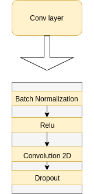
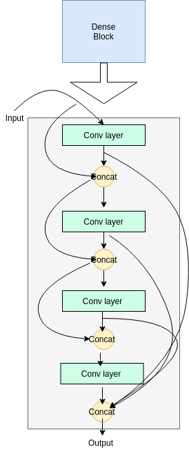

# FC-DenseNet-Tensorflow
This is a re-implementation of the 100 layer tiramisu, technically a fully convolutional DenseNet, in TensorFlow ([Tiramisu](https://arxiv.org/abs/1611.09326)). The aim of the repository is to break down the working modules of the network, as presented in the paper, for ease of understanding. To facilitate this, the network is defined in a class, with functions for each block in the network. This promotes a modular view, and an understanding of what each component does, individually.
I tried to make the the model code more readable, and this is the main aim of the this repository.

# Network Architecture
<p align="center">
  
</p>

# Submodules
The "submodules" that build up the Tiramisu are explained here.
Note: The graphics are just a redrawing of the ones from the original paper.
## The Conv Layer:
The "conv layer" is the most atomic unit of the FC-DenseNet, it is the building block of all other modules. The following image shows the conv layer:
<p align="center">
  
</p>
In code, it is implemented as:

```python
def conv_layer(self, x, training, filters, name):
    with tf.name_scope(name):
        x = self.batch_norm(x, training, name=name+'_bn')
        x = tf.nn.relu(x, name=name+'_relu')
        x = tf.layers.conv2d(x,
                             filters=filters,
                             kernel_size=[3, 3],
                             strides=[1, 1],
                             padding='SAME',
                             dilation_rate=[1, 1],
                             activation=None,
                             kernel_initializer=tf.contrib.layers.xavier_initializer(),
                             name=name+'_conv3x3')
        x = tf.layers.dropout(x, rate=0.2, training=training, name=name+'_dropout')
```
As can be seen, each "convolutional" layer is actually a 4 step procedure of batch normalization -> Relu -> 2D-Convolution -> Dropout.

## The Dense Block
The dense block is a sequence of convolutions followed by concatenations. The output of a conv layer is concated depth wise with its input, this forms the input to the next layer, and is repeated for all layers in a dense block. For the final output i.e., the output of the Dense Block, all the outputs of each conv layer in the block are concated, as shown:
<p align="center">
  
</p>

In code, it is implemented as:
```python
def dense_block(self, x, training, block_nb, name):
    dense_out = []
    with tf.name_scope(name):
        for i in range(self.layers_per_block[block_nb]):
            conv = self.conv_layer(x, training, self.growth_k, name=name+'_layer_'+str(i))
            x = tf.concat([conv, x], axis=3)
            dense_out.append(conv)

        x = tf.concat(dense_out, axis=3)

    return x
```

# How to Run
To run the network on your own dataset, do the following:
1. Clone this repository.
2. Open up your terminal and navigate to the cloned repository
3. Type in the following:
```bash
python main.py --train_images=path/to/train/image/folder --train_masks=path/to/train/masks/folder --
val_images=path/to/validation/images --val_masks=path/to/validation/masks --ckpt_dir=path/to/save/checkpoint/at --layers_per_block=4,5,7,10,12,15 --batch_size=8 --epochs=10 --growth_k=16 --num_classes=2 --learning_rate=0.001
```
The "layers_per_block" argument is only specified for the downsample path, upto the final bottleneck dense block, the upsample path is then automtically built by mirroring the downsample path.

# TODOs:
1. Add some more functionality in the code.
2. Add more detail into this readme.
3. Add summary writing and model graph saving.
4. Rework command line arguments.
5. Update with some examples of performance once trained.
