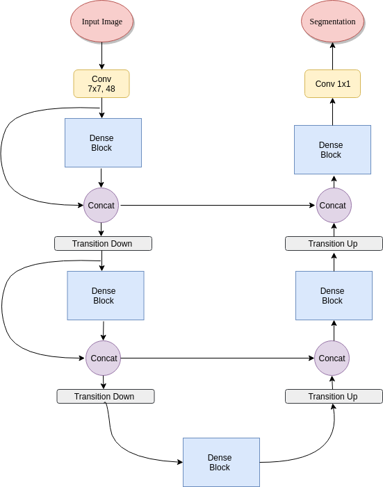

# FC-DenseNet-Tensorflow
This is an implementation of the 100 layer tiramisu, technically a fully convolutional DenseNet, in TensorFlow ([Tiramisu](https://arxiv.org/abs/1611.09326)). The aim of the repository is to break down the working modules of the network, as presented in the paper, for ease of understand. To facilitate, the network is defined in a class, with functions for each block in the network. This promotes a modular view of the network, and understanding of what each component does, individually.

# Network Architecture
<p align="center">
  
</p>


# How to Run
To run the network on your own dataset, do the following:
1. Clone this repository.
2. Open up your terminal and navigate to the cloned repository
3. Type in the following:
```bash
python main.py --train_images=path/to/train/image/folder --train_masks=path/to/train/masks/folder --
val_images=path/to/validation/images --val_masks=path/to/validation/masks --ckpt_dir=path/to/save/checkpoint/at --layers_per_block=4,5,7,10,12,15 --batch_size=8 --epochs=10 --growth_k=16 --num_classes=2 --learning_rate=0.001
```
The "layers_per_block" argument is only specified for the downsample path, upto the final bottleneck dense block, the upsample path is then automtically built by mirroring the downsample path.

# TODOs:
1. Add some more functionality in the code.
2. Add more detail into this readme.
3. Add summary writing and model graph saving.
4. Rework command line arguments.
5. Update with some examples of performance once trained.
